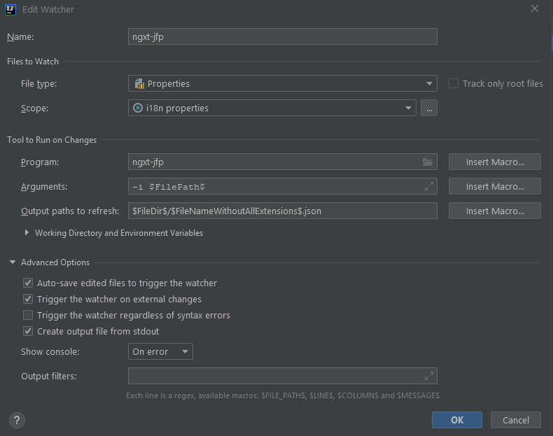

# Summary

Angular applications that use [ngx-translate](https://github.com/ngx-translate/core) often store the translations in json files.  Editing those files manually isn't ideal.  Especially when compared to using [IntelliJ Resource Bundles](https://www.jetbrains.com/help/idea/resource-bundle.html).

This node.js module converts properties files to simple json.  This allows you to write your language files as a resource bundle using [File Watchers](https://www.jetbrains.com/help/idea/using-file-watchers.html) to automatically call this module.

# Installation

```cmd
npm i -g ngx-translate-json-from-properties
```

# Usage

```cmd
$ ngxt-jfp --help
Options:
  --help          Show help                                            [boolean]
  --version       Show version number                                  [boolean]
  --input, -i     input file path
```

## IntelliJ

### Project Structure

Create your language properties files (`i18n-lang.properties`), such as `i18n-en-CA.properties`.  IntelliJ will now let you edit these together at once as a Resource Bundle.

### File Watcher

Create a file watcher and configure it.  For example:


